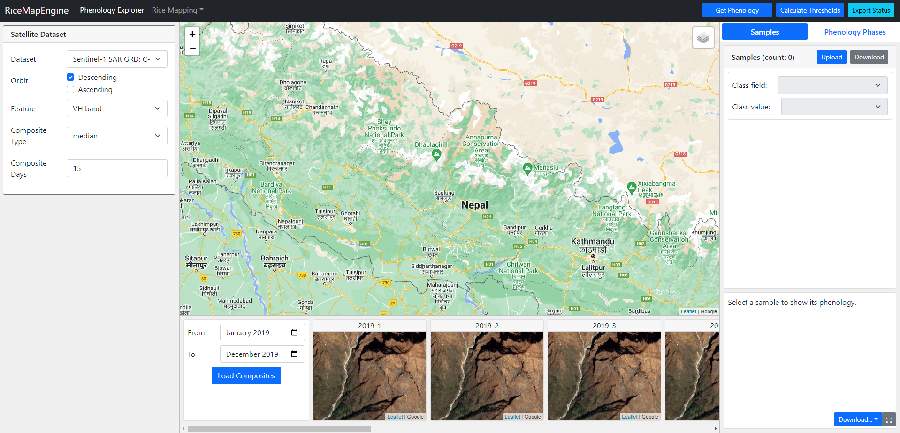
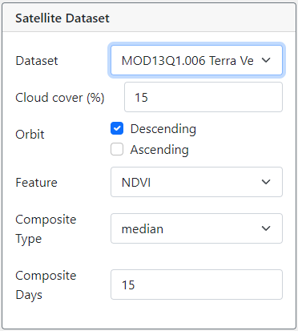
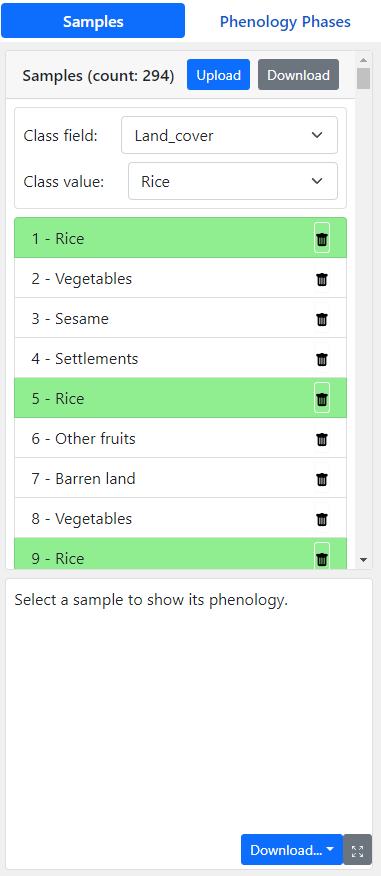

# User Manual for RiceMapEngine

_Author: Zhiqi Yu_  
_Date: 6/24/2022_

## 1. Introduction

The RiceMapEngine is a web application that uses Google Earth Engine APIs to perform rice mapping with remote sensing. 

This application mainly includes three sub-applications, namely Phenology Explorer (PE), Empirical Thresholding (ET), and Supervised Classification (SC), that serve different purposes in the workflow of rice mapping. 

Specifically, PE provides functions to inspect ground truth samples by the phenology information acquired from remote sensing. By identifying phenology stages of ground truth samples based on remote sensing-generated phenology information, users can identify true rice samples and false rice samples, which should be removed for further analysis. The PE also generates empirical thresholds from ground truth samples for user-defined phenology phases. 

The ET and SC are two methods for rice classification. ET allows rice mapping using empirical thresholds. Thresholds represent value ranges for the remote sensing images within certain phenological phases. The thresholds can be generated from PE or from previous experience. The classification result is generated simply by determine if a pixel value is within the provided value range. Ground truth samples are not required for this method.

SC is the good old supervised classification method that trains machine learning models with ground truth samples and classify remote sensing images to rice maps. Ground truth samples are required for this method. 

Following sections give details of each sub-application.

## 2. Phenology Explorer

The UI of PE is shown in the following figure:

The overall UI is divided into several panels. 

### 2.1. Left Panel

The left panel UI allows users to select what and how satellite images are used to extract phenology information. 

These parameters are available for customization:

- The data source, i.e., what satellite data to use, can be radar or optical data.
- Cloud cover (only relevant for optical data source), i.e., the maximum **percentage** of cloud cover allowed on each image.
- Orbit, ascending and/or decending. 
- Feature, i.e., a single number to compute from original bands, can be the raw band values, or indices liek NDVI, etc.
- Composite Type. This is the aggregation method to use for making image composites. **Note:** The composite is necessary because the study area can span across multiple swaths, which cause images to have different collection time.
- Composite Days. This is the number of days as intervals to make composites. Together with composite type, this defines how the image composites will be made. 

### 2.2. Middle Panel

The middle panel includes a map for visualization, and a bottom area to show monthly false color composites to assist phenology inspection. 

### 2.2. The right panel 

The right panel includes two tabs, namely **Samples** and **Phenology Phases**. The sample tab as shown in the figure below includes a list of ground truth samples uploaded to the application, and a chart that shows time-series satellite image data that assumbly captures critical phenology information. The phenology phases as shown in the second figure below allows users to set up the date ranges of phenology phases, and acquire thresholds for those phases according to the satellite image data. 

#### 2.2.1. Sample tab

The sample tab is shown in figure below. 

**Ground truth sample upload/download**

Users use the **Upload** button to load the ground truth samples to the application. The accepted file should be a **zipped** shapefile. The **Download** button can be used to download the modified version of ground truth samples from the application.

Once the ground truth samples are loaded in the application, several things will happen:

1. The samples will be shown on the map.
2. A list of samples will show in the panel

In the sample container, there are two parameters that are necessary:

- Class field: the property name from each sample that represents the class of the sample.
- Class value: the literal value of the "class field" that represents the rice class.

Changing the class field and class value has several effects:

1. The title of each sample in the list will change to the value of the selected class field of each sample. For example, in the figure, the first sample's "Land_cover" field value is "Rice", thus the title, 
2. The samples that matches the selected class field and class values will be highlighted. For example, because "Rice" is selected as the target class, the first sample is highlighted in light green color.
3. The color of samples shown on the map will change to reflect the classes. Target classes will be red, and non-target classes will be blue. 

****

## Empirical Thresholding

## Supervised Classification